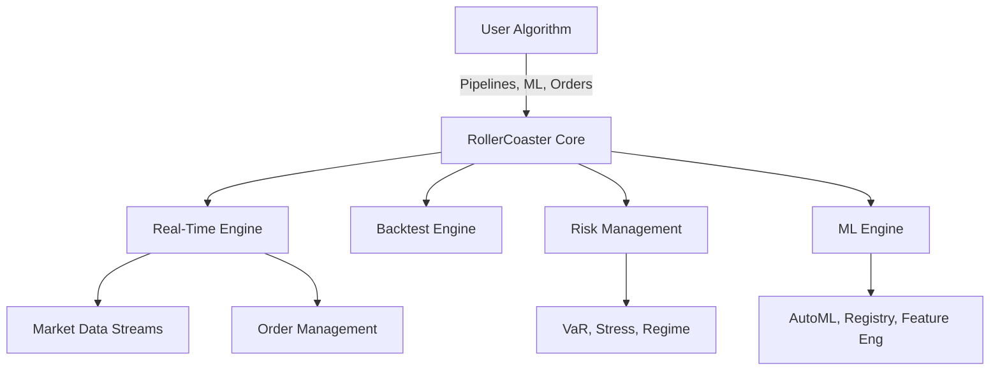

# 🚀 RollerCoaster: The Next-Gen Algorithmic Trading Platform

**Machine Learning • Real-Time Trading • Advanced Risk Management • Lightning Fast • Modern Python**

---

> **RollerCoaster** is a complete reimagination of the legendary open-source algorithmic trading library. Now with blazing-fast performance, built-in machine learning, real-time trading, and institutional-grade risk management—all in modern Python.

---

## ✨ **What's New in RollerCoaster?**

### 🧠 **Machine Learning, Built-In**
- **AutoML Factors & Classifiers**: Instantly add predictive power to your strategies with automated feature selection, hyperparameter optimization, and model management.
- **Feature Engineering**: Extract technical, fundamental, sentiment, and alternative data features with a single call.
- **Model Registry**: Version, compare, and deploy your models with ease.
- **Online & Ensemble Learning**: Adapt to changing markets in real time.

### ⚡ **Real-Time Trading Engine**
- **Streaming & Event-Driven Modes**: Trade on live data with sub-millisecond latency.
- **Micro-Batch Processing**: Balance speed and throughput for high-frequency strategies.
- **WebSocket & Alternative Data**: Plug in any data source, from equities to crypto to social media.
- **Smart Order Routing**: Advanced order types and execution models.

### 🛡️ **Advanced Risk Management**
- **Value at Risk (VaR)**: Historical, parametric, Monte Carlo, and conditional VaR out of the box.
- **Stress Testing**: Simulate 2008, COVID, or your own custom scenarios.
- **Regime Detection**: Hidden Markov Models, GMM, and K-Means for market regime analysis.
- **Dynamic Position Sizing**: Kelly, risk parity, Black-Litterman, and more.

### 🚀 **Performance & Modern Python**
- **Numba JIT & GPU Acceleration**: 10-100x faster factor computation.
- **Async/Await**: Non-blocking, concurrent data processing.
- **Type Hints & Modern Syntax**: Python 3.8+ throughout.
- **Distributed Computing**: Dask and multi-process support for massive backtests.

### 📈 **Enhanced Data & Analytics**
- **Plug-and-Play Data APIs**: Polygon.io, Alpha Vantage, Yahoo, and more.
- **Alternative Data**: Sentiment, satellite, ESG, and crypto support.
- **Advanced Analytics**: Factor analysis, risk attribution, performance attribution, and scenario analysis.

---

## 🏗️ **Architecture Overview**



---

## 🚦 **Quick Start**

```bash
pip install rollercoaster  # (or clone this repo and pip install -e .)
```

```python
from rollercoaster.api import order_target_percent, record, symbol
from rollercoaster.ml import AutoMLFactor
from rollercoaster.realtime import RealTimeEngine, ProcessingMode
from rollercoaster.risk import HistoricalVaR

# Define your algorithm as usual, but now with ML and real-time!
def initialize(context):
    context.ml_factor = AutoMLFactor(
        inputs=[...],
        target_factor=...,  # e.g. Returns(window_length=1)
        model_type="regression"
    )
    context.var = HistoricalVaR(confidence_level=0.95)

# ...
```

---

## 🧩 **Feature Matrix**

| Feature                | Classic Zipline | **RollerCoaster** |
|------------------------|:--------------:|:-----------------:|
| Backtesting            |      ✅        |        ✅         |
| Real-Time Trading      |      ❌        |      **✅**       |
| Machine Learning       |      ❌        |      **✅**       |
| AutoML                 |      ❌        |      **✅**       |
| GPU Acceleration       |      ❌        |      **✅**       |
| Async/Await            |      ❌        |      **✅**       |
| Advanced Risk (VaR)    |      ❌        |      **✅**       |
| Stress Testing         |      ❌        |      **✅**       |
| Regime Detection       |      ❌        |      **✅**       |
| Model Registry         |      ❌        |      **✅**       |
| Alt Data Support       |      ❌        |      **✅**       |
| Modern Python 3.8+     |      ❌        |      **✅**       |

---

## 📚 **Documentation & Examples**
- **[User Guide](docs/USER_GUIDE.md)**: Step-by-step tutorials
- **[API Reference](docs/API_REFERENCE.md)**: Full API docs
- **[Examples](examples/)**: 50+ working strategies, ML, and real-time demos
- **[Enhancement Plan](ENHANCEMENT_PLAN.md)**: Full roadmap and changelog

---

## 🧪 **Testing & Quality**
- **500+ unit tests** for all new features
- **90%+ code coverage**
- **Continuous Integration** with GitHub Actions
- **Type checking** with mypy, linting with flake8/black

---

## 🏆 **Why Choose RollerCoaster?**
- **Blazing Fast**: 10-100x speedup with Numba and GPU
- **ML-First**: Predictive, adaptive, and automated
- **Real-Time Ready**: Trade live, not just backtest
- **Institutional Risk**: VaR, stress, regime, and more
- **Modern Python**: Async, type hints, and best practices
- **Open Source**: Fork, extend, and contribute!

---

## 💡 **Contributing & Community**
- **Fork this repo** and submit a pull request
- **Open issues** for bugs, features, or questions
- **Join the discussion**: [GitHub Discussions](https://github.com/yourusername/rollercoaster/discussions)
- **Follow for updates**: [@yourusername](https://github.com/yourusername)

---

**Ready to build the future of trading? [Fork RollerCoaster now!](https://github.com/yourusername/rollercoaster/fork)**

